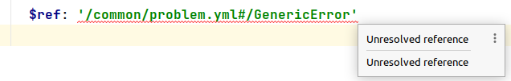

# openapi-plugin-links

This project demonstrates that `openapi-generator-maven-plugin` understands classpath relative links using `$ref`: [path-data.yml](./contract-v1/src/main/resources/path-data.yml)

However, IntelliJ's built-in [OpenAPI Specifications](https://plugins.jetbrains.com/plugin/14394-openapi-specifications) plugin shows an "Unresolved reference" error for the same link:

By executing `./mvnw clean test`, the `application/src/test/java/org/example/ApplicationTest.java` test passes and it uses the `Problem` class which is defined in the [common module](./common/src/main/resources/common/problem.yml) which is depended on by the [contract-v1 module](./contract-v1/pom.xml) (via the dependencies of `openapi-generator-maven-plugin`).
